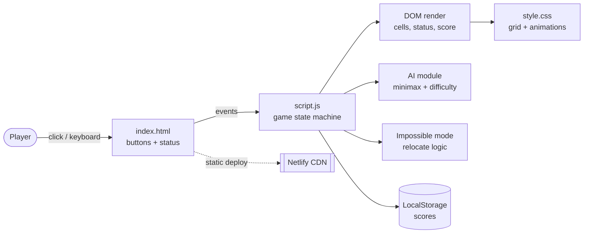

# Tic Tac Toe — Step-by-Step Build Guide

> **Archived: original build playbook.** This document is the original roadmap used to build the Tic Tac Toe game from an empty folder to a deployed static site. It captures the intended order of work, the reasoning behind each decision, and the acceptance criteria for every step. The codebase may have evolved since this guide was written, so treat it as a making-of narrative rather than the source of truth. For current setup, architecture, and deployment notes, see [../README.md](../README.md).

---

> **Project Summary:** Tic Tac Toe is a dependency-free, responsive browser game built with vanilla HTML, CSS, and JavaScript. It offers two game modes (local two-player and vs AI) and four AI difficulty levels: Easy (random), Medium (70% optimal), Hard (unbeatable Minimax with alpha-beta pruning), and a playful Impossible mode where the AI cheats by relocating the player's moves. Scores persist across sessions via the LocalStorage API, the UI is accessible (ARIA grid semantics and a live status region), and the whole app ships as static files to a CDN host such as Netlify.

Each step below is a self-contained prompt. Execute them in order.

Stack: HTML5, CSS3 (Grid, Flexbox, Custom Properties, Keyframe Animations), Vanilla JavaScript (ES6+, async/await, Promises), Minimax with alpha-beta pruning, LocalStorage API, Netlify static hosting.

---

## Table of Contents

**PHASE 1 — Project Foundation**

- STEP 1 — Project Scaffolding & File Structure
- STEP 2 — Semantic HTML Layout
- STEP 3 — Theme, Layout & Responsive CSS

**PHASE 2 — Core Game Logic**

- STEP 4 — Game State & Constants
- STEP 5 — Move Handling & Turn Switching
- STEP 6 — Win/Draw Detection & Highlighting

**PHASE 3 — AI Opponent**

- STEP 7 — Mode & Difficulty Selection
- STEP 8 — Minimax Engine (Hard / Unbeatable)
- STEP 9 — Easy & Medium Difficulty Tiers

**PHASE 4 — Impossible Mode & Polish**

- STEP 10 — Cheating AI (Impossible Mode)
- STEP 11 — Animations & Visual Feedback

**PHASE 5 — Accessibility, Persistence & Deploy**

- STEP 12 — Accessibility (ARIA Grid + Live Status)
- STEP 13 — Score Persistence (LocalStorage)
- STEP 14 — Community Docs & Deployment

**Appendices**

- Appendix A — Shared Constants
- Appendix B — Common Pitfalls
- Appendix C — Pre-flight Checklist

---

## Global Build Rules (apply to EVERY step)

- **No git operations.** Do not run `git` commands, do not commit, and do not push. Version control is handled manually by the user.
- Do not install unapproved packages. This project is intentionally dependency-free; keep it that way unless the user explicitly approves a dependency.
- Do not run long-running processes (watchers, servers) unless the user requests it. A simple static server is enough for manual testing.
- Treat every step as self-contained: it states its goal, the files it touches, implementation notes, and an acceptance checklist.
- Prefer modern, native APIs (ES6+, `async/await`, Promises, `localStorage`) over libraries.
- Keep function and variable names in English and camelCase; keep code clean, readable, and DRY.
- Prioritize accessibility, performance, and security at every step.

---

## Architecture at a Glance



The app is a single-page, client-only state machine. `script.js` owns the `board` array and turn state, renders changes directly to DOM nodes defined in `index.html`, delegates AI decisions to pure helper functions (`minimax`, `getBestMove`), and persists scores to `localStorage`. There is no backend, build step, or framework.

---

# PHASE 1 — PROJECT FOUNDATION

---

## STEP 1 — Project Scaffolding & File Structure

**Goal:** Create the minimal static file layout.

**Files/folders to create:**

```
tic-tac-toe/
├── index.html
├── css/
│   └── style.css
├── js/
│   └── script.js
├── .gitignore
└── README.md
```

**Implementation notes:**

- No package manager, no build tooling. The site runs by opening `index.html` or serving the folder statically.
- Add a `.gitignore` covering OS/editor noise: `node_modules/`, `.DS_Store`, `Thumbs.db`, `.vscode/`, `*.log`.

**Acceptance checklist:**

- [ ] Folder tree exists as above.
- [ ] `index.html` loads `css/style.css` and `js/script.js` with correct relative paths.

---

## STEP 2 — Semantic HTML Layout

**Goal:** Build the accessible page skeleton.

**Files to edit:** `index.html`

**Implementation notes:**

- Wrap the game in a `<main class="container">` with an `<h1>` title.
- Add a mode selector (two `.mode-btn` buttons: `data-mode="pvp"` and `data-mode="ai"`).
- Add a difficulty selector (`.diff-btn` buttons for `easy`, `medium`, `hard`, `impossible`), hidden by default with a `hidden` class.
- Add a score board with `#score-x` and `#score-o`.
- Add a status line `#game-status`.
- Add the grid `#game-grid` containing nine `<button class="cell">` elements with `data-index="0..8"`.
- Add a `#restart-btn` and a footer with author links (`rel="noopener noreferrer"` on external links).

**Acceptance checklist:**

- [ ] All interactive controls are real `<button>` elements.
- [ ] Cells carry `data-index` 0 through 8.
- [ ] External links use `target="_blank"` with `rel="noopener noreferrer"`.

---

## STEP 3 — Theme, Layout & Responsive CSS

**Goal:** Style the game with a dark theme and a responsive grid.

**Files to edit:** `css/style.css`

**Implementation notes:**

- Define CSS Custom Properties in `:root` (`--bg-color`, `--cell-bg`, `--cell-hover`, `--text-color`, `--accent-red`, `--accent-dark-red`, `--border-radius`, `--gap`).
- Use Flexbox to center the layout and CSS Grid (`grid-template-columns: repeat(3, 1fr)`) for the board.
- Mobile-first cell height (`100px`), scaling up via `@media (min-width: 600px)`.
- Add `:hover` and `:active` feedback on cells and buttons.

**Acceptance checklist:**

- [ ] Board renders as a 3x3 grid on mobile and desktop.
- [ ] Colors are driven by CSS variables (single source of truth for theming).

---

# PHASE 2 — CORE GAME LOGIC

---

## STEP 4 — Game State & Constants

**Goal:** Establish the single source of truth for game state.

**Files to edit:** `js/script.js`

**Implementation notes:**

- Cache DOM references at the top (`cells`, `statusText`, `restartBtn`, score elements, mode/difficulty buttons).
- Declare state: `board` (length-9 array of `""`), `currentPlayer` (`"X"`), `isGameRunning`, `isProcessingMove` (lock flag), and `scores`.
- Declare constants: `HUMAN = "X"`, `AI = "O"`, and `WIN_CONDITIONS` (see Appendix A).
- Call `initializeGame()` once to attach listeners and set the initial status.

**Acceptance checklist:**

- [ ] `board` is the only place that holds authoritative cell state.
- [ ] `WIN_CONDITIONS` contains all 8 winning lines.

---

## STEP 5 — Move Handling & Turn Switching

**Goal:** Place marks and alternate turns.

**Files to edit:** `js/script.js`

**Implementation notes:**

- `handleCellClick` reads `data-index`, ignores the click if the cell is filled, the game is over, or `isProcessingMove` is set.
- `makeMove(index, player)` updates `board`, sets the cell text, adds the `x`/`o` class, and updates the cell `aria-label`.
- `switchPlayer()` toggles `currentPlayer` and updates the status text.

**Acceptance checklist:**

- [ ] Clicking a filled cell does nothing.
- [ ] Turn indicator updates after every valid move.

---

## STEP 6 — Win/Draw Detection & Highlighting

**Goal:** Detect terminal states and react.

**Files to edit:** `js/script.js`

**Implementation notes:**

- `checkWinner(boardState)` returns `{ winner, winningCells }` by scanning `WIN_CONDITIONS`. Keep it pure so the AI can reuse it.
- `getAvailableMoves(boardState)` returns indices of empty cells.
- `checkGameEnd()` orchestrates: on win, update status, stop the game, highlight cells, update score; on full board, declare a draw; otherwise switch player.
- `restartGame()` resets `board`, classes, labels, and the lock flag.

**Acceptance checklist:**

- [ ] A completed line ends the game and highlights the winning cells.
- [ ] A full board with no winner shows "Draw!".
- [ ] Restart fully clears the board and status.

---

# PHASE 3 — AI OPPONENT

---

## STEP 7 — Mode & Difficulty Selection

**Goal:** Switch between PvP and AI, and pick difficulty.

**Files to edit:** `js/script.js`

**Implementation notes:**

- `selectGameMode(mode)` toggles active button styling, shows/hides the difficulty selector, and restarts.
- `selectDifficulty(difficulty)` updates `aiDifficulty` and restarts.
- After a human move in AI mode, if it is the AI's turn, trigger the AI with a short `setTimeout` delay and a `thinking` status indicator for better UX.

**Acceptance checklist:**

- [ ] Difficulty selector is visible only in AI mode.
- [ ] Changing mode or difficulty restarts the round cleanly.

---

## STEP 8 — Minimax Engine (Hard / Unbeatable)

**Goal:** Implement an optimal, unbeatable AI.

**Files to edit:** `js/script.js`

**Implementation notes:**

- `getBestMove()` iterates available moves, scores each with `minimax`, and returns the highest-scoring index.
- `minimax(boardState, depth, isMaximizing, alpha, beta)`:
  - Terminal scores: AI win `10 - depth`, human win `depth - 10`, draw `0`. The depth term makes the AI prefer faster wins and slower losses.
  - Alpha-beta pruning: break the loop when `beta <= alpha`.
- Always undo the simulated move (`boardState[move] = ""`) after recursion to keep the array clean.

**Acceptance checklist:**

- [ ] AI takes an immediate winning move when available.
- [ ] AI blocks the opponent's immediate win.
- [ ] Hard mode never loses (best case for the human is a draw).

---

## STEP 9 — Easy & Medium Difficulty Tiers

**Goal:** Provide beatable difficulty levels.

**Files to edit:** `js/script.js`

**Implementation notes:**

- `getEasyMove()` returns a random available index.
- `getMediumMove()` returns `getBestMove()` 70% of the time, otherwise `getEasyMove()`.
- `makeAIMove()` dispatches on `aiDifficulty` and then calls `checkGameEnd()`.

**Acceptance checklist:**

- [ ] Easy plays random legal moves.
- [ ] Medium feels challenging but beatable.

---

# PHASE 4 — IMPOSSIBLE MODE & POLISH

---

## STEP 10 — Cheating AI (Impossible Mode)

**Goal:** A humorous mode where the AI relocates the player's moves.

**Files to edit:** `js/script.js`

**Implementation notes:**

- `handleImpossibleMove(cellIndex)` is `async` and guarded by `isProcessingMove` with a `try/finally` to always release the lock.
- `shouldAICheat(index)` decides whether to cheat (early-game dominance, blocking an imminent player win, contested strategic squares, or random mischief).
- `relocatePlayerMove(originalIndex)` is `async`: it animates the steal, `await`s a delay, then mutates the board and re-places the mark at the worst available square (`findWorstPosition`).
- **Critical ordering:** `await relocatePlayerMove(...)` before calling `checkGameEnd()`, so the end-of-game check runs against the updated board. See Appendix B.
- `getImpossibleMove()` takes an immediate win if present, otherwise falls back to `getBestMove()`.

**Acceptance checklist:**

- [ ] After a cheat completes, the board holds exactly one X and one O per full exchange (no duplicated or lost marks).
- [ ] `isProcessingMove` is always released, even on early return.
- [ ] Rapid clicks during the async window are ignored.

---

## STEP 11 — Animations & Visual Feedback

**Goal:** Make the game feel alive.

**Files to edit:** `css/style.css`, `js/script.js`

**Implementation notes:**

- Add keyframe animations: `pulse` (winning cells), `evilGlow` (Impossible button), `thinking`/`evilThinking` (status indicator), `stolenCell` (relocation), `cheatPopup` (taunt message).
- `showCheatMessage()` injects a temporary `.cheat-message` element with a random taunt and removes it after the animation.

**Acceptance checklist:**

- [ ] Winning cells pulse.
- [ ] Cheat messages appear and auto-dismiss without leaving DOM residue.

---

# PHASE 5 — ACCESSIBILITY, PERSISTENCE & DEPLOY

---

## STEP 12 — Accessibility (ARIA Grid + Live Status)

**Goal:** Make the game usable with assistive technology.

**Files to edit:** `index.html`, `css/style.css`, `js/script.js`

**Implementation notes:**

- Give `#game-status` `role="status"`, `aria-live="polite"`, and `aria-atomic="true"` so turn/win/draw changes are announced.
- Provide valid ARIA grid semantics: wrap each row of three cells in a `<div class="grid-row" role="row">`, keep `role="grid"` on the container, and add `role="gridcell"` to each cell.
- Use `display: contents` on `.grid-row` so the CSS Grid layout is preserved while the ARIA structure is valid.
- Keep `aria-label` dynamic: update it in `makeMove` (`Cell N, X/O`), in `restartGame` (`Cell N, empty`), and when a cell is cleared during relocation.

**Acceptance checklist:**

- [ ] Status changes are announced by screen readers.
- [ ] Each cell exposes its position and current state via `aria-label`.
- [ ] Visual grid layout is unchanged by the row wrappers.

---

## STEP 13 — Score Persistence (LocalStorage)

**Goal:** Remember scores across page reloads and sessions.

**Files to edit:** `js/script.js`

**Implementation notes:**

- Define a storage key constant (e.g. `SCORES_STORAGE_KEY = "ticTacToeScores"`).
- `loadScores()` parses stored JSON, validates it with `Number.isFinite`, and falls back to `{ X: 0, O: 0 }`. Wrap in `try/catch` for private-mode safety.
- `saveScores()` writes JSON to `localStorage` inside a `try/catch`.
- `renderScores()` centralizes score DOM updates (DRY); call it on init and after each win.
- `updateScore(winner)` increments, renders, and saves.

**Acceptance checklist:**

- [ ] Scores survive a page reload.
- [ ] Corrupt or unavailable storage degrades gracefully to zeros.

---

## STEP 14 — Community Docs & Deployment

**Goal:** Prepare the repository for open source and ship it.

**Files to edit/create:** `README.md`, `LICENSE`, `.github/` templates.

**Implementation notes:**

- Author a comprehensive `README.md` (features, live demo, tech stack, installation, usage, how-it-works, customization, contributing, license).
- Add an MIT `LICENSE`.
- Add GitHub community health files under `.github/`: `CODE_OF_CONDUCT.md`, `CONTRIBUTING.md`, `SECURITY.md`, `PULL_REQUEST_TEMPLATE.md`, and `ISSUE_TEMPLATE/` (`bug_report.yml`, `feature_request.yml`, `config.yml`).
- Deploy as static files to Netlify (drag-and-drop or Git integration). No build command is required.

**Acceptance checklist:**

- [ ] `README.md` documents all four difficulty levels and score persistence.
- [ ] Community files live under `.github/`.
- [ ] Live site loads and plays correctly.

---

# Appendix A — Shared Constants

```javascript
const HUMAN = "X";
const AI = "O";

// rows, columns, diagonals
const WIN_CONDITIONS = [
    [0, 1, 2], [3, 4, 5], [6, 7, 8], // Rows
    [0, 3, 6], [1, 4, 7], [2, 5, 8], // Columns
    [0, 4, 8], [2, 4, 6]             // Diagonals
];

const SCORES_STORAGE_KEY = "ticTacToeScores";
```

---

# Appendix B — Common Pitfalls

- **Async relocation race (Impossible mode):** If `relocatePlayerMove` mutates the board inside a `setTimeout` while `checkGameEnd()` runs synchronously right after, the end-of-game check evaluates a stale board. Fix: make relocation `async`, `await` it, then check. A reusable `delay(ms)` Promise helper keeps the animation sequencing readable.
- **Lost lock on early return:** Releasing `isProcessingMove` only at the end of `handleImpossibleMove` leaves the board locked when the game ends mid-flow. Fix: use `try/finally`.
- **Minimax mutation leaks:** Forgetting to reset `boardState[move] = ""` after the recursive call corrupts the shared array. Always undo simulated moves.
- **`display: contents` and ARIA:** Row wrappers are required for valid `role="gridcell"`, but plain `<div>`s would break the CSS Grid. Use `display: contents` so the buttons still flow into the parent grid.
- **Storage in private mode:** `localStorage` can throw. Always guard reads and writes with `try/catch`.

---

# Appendix C — Pre-flight Checklist

- [ ] PvP: win (row/column/diagonal), draw, restart, and occupied-cell guards all work.
- [ ] AI: Easy is random; Medium is mixed; Hard is unbeatable (verify win and block moves).
- [ ] Impossible: board stays consistent after cheats; lock always releases; rapid clicks ignored.
- [ ] Accessibility: `aria-live` announcements, `role="grid"/"row"/"gridcell"`, dynamic `aria-label`s.
- [ ] Persistence: scores survive reload; corrupt storage falls back to zeros.
- [ ] No console errors; no unused code; theme driven by CSS variables.
- [ ] Responsive on mobile and desktop.
